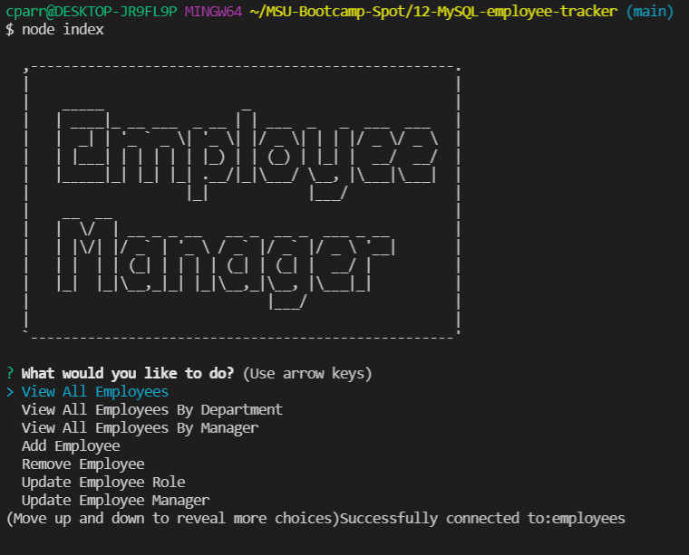

# 12-MySQL-employee-tracker

```
As a business owner
I want to be able to view and manage the departments, roles, and employees in my company
So that I can organize and plan my business
```

## Tools

Using MySQL, Inquirer, and console.table we build a database and print to the console to allow a user to add, view, update, and delete a company's employees, roles, and departments.

## Functionality

Run 'npm i' and seed the database, then run 'node index' to start the application and follow the prompts.

## Example

A screenshot of the working application:



A link to a video demonstration showing working example:

[MySQL Demo](https://drive.google.com/file/d/1T00TkJasJAuROfMZ2GM3oHwBeFFfNfcQ/view)
